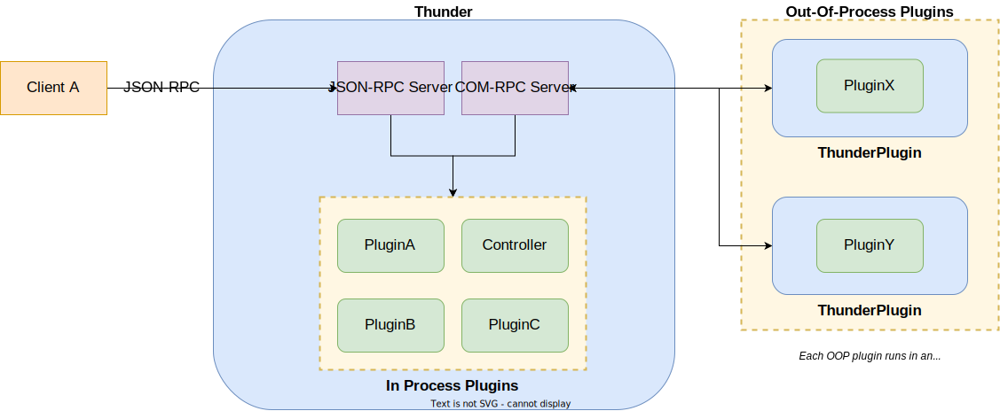

A Thunder plugin can be configured to run in multiple different "execution modes". Each mode defines how the plugin code is executed, however it does not affect how a client will interact with the plugin. Clients will not know (and shouldn't care!) which mode a plugin is running in, and will continue to connect/communicate through the main Thunder process.

Providing a plugin correctly implements a COM-RPC interface, there should be no additional development work in the plugin to support running in different execution modes, so the decision on which mode each plugin runs in can be an architecture decision based on platform, performance and security requirements.



## Setting the execution mode

The execution mode of a plugin is set in its configuration file. If an execution mode is not specified a plugin will defaut to running in-process. 

To change the mode, set the `mode` value in the `configuration.root` object to:

* Off (aka in-process)
* Local (aka out-of-process)
* Container
* Distributed

As with other config options, this can be changed via the Controller plugin at runtime. The below example config sets the plugin mode to `Local` in order to run the plugin out-of-process

```json
{
   "locator":"libThunderSamplePlugin.so",
   "classname":"SamplePlugin",
   "startmode":"Activated",
   "configuration":{
      "root":{
         "mode":"Local"
      }
   }
}
```

## In Process Plugins

This is the simplest execution mode, and the default if a mode is not set. An in-process plugin is loaded into and executed inside the main WPEFraemwork process.

**Advantages**

* Simple - there is no additional overhead or complexity from running additional processes
* Highest performance - no additional RPC hops are required to communicate with the plugin. All calls to the plugin from the Thunder process are just local virtual function calls.
    * If an in-process plugin needs to communicate with another in-process plugin, Thunder will resolve any COM-RPC interface calls to local function calls. This removes the need to serialise/deserialise any data or cross any IPC boundary and results in the fastest performance possible

**Disadvantages**

* Stability - if a plugin is unstable or buggy and causes a crash then it will bring down the entire Thunder process
* Resource monitoring - since the plugin runs inside the Thunder process, it is much harder to accurately monitor the CPU/memory usage from that specific plugin
* Security - the plugin runs with the same permissions and privileges as the main Thunder process

## Out-Of-Process (OOP) Plugins

If a plugin is configured to run out-of-process, it will run in its own individual hosting process called `ThunderPlugin` instead of in the main Thunder process. Each out-of-process plugin will run in a separate ThunderPlugin instance.

When the plugin is activated, Thunder will automatically spawn a ThunderPlugin instance as a child process. The ThunderPlugin host will load the plugin library and establish a COM-RPC connection between itself and the main Thunder process. This COM-RPC connection is how clients communicating with the main Thunder process are still able to invoke methods on out-of-process plugins. The ThunderPlugin process will be stopped when the plugin is deactivated.

!!! tip
	For larger, more complex out-of-process plugins, it is often useful to split a plugin into two separate libraries - see [here](../split-implementation) for more details.

**Advantages**

* Reliability - if a plugin crashes, it will only bring down the ThunderPlugin instance and therefore not affect any other plugin. It can then be restarted as necessary
* Monitoring - by running a plugin in its own process, it becomes easier to monitor the resource usage (memory, CPU etc) of that plugin
* Security - out of process plugins can be run in a different user/group to the main Thunder process (which might be running as root) to reduce the privileges of the plugin and increase security
* Resource control - the size of the thread pool and process priority can be set for the ThunderPlugin host, allowing more custom tuning for specific plugin requirements

**Disadvantages**

* Performance - since there is now an additional RPC hop over COM-RPC to invoke methods on the plugin, this can introduce some latency (although COM-RPC is efficient so this is very minimal)
    * It may also take slightly longer to activate the plugin due to the overhead of starting the ThunderPlugin host
* Resource usage - potentially increased resource usage from spawning and running a new process

## Container

!!! note
	Support for containers is not enabled by default.
	
	To enable, build Thunder with the `-DPROCESSCONTAINERS=ON` cmake option and select a backend with `-DPROCESSCONTAINERS_XXX=ON` where `XXX` is the backend you wish to use.

An extension to the out-of-process mode, container mode will run the ThunderPlugin host instead a containerised environment.  Thunder supports various container integrations using the `ProcessContainer` abstraction mechanism in Thunder core:

- [LXC ](https://linuxcontainers.org/)
- [runc](https://github.com/opencontainers/runc)
- [crun](https://github.com/containers/crun)
- [Dobby](https://github.com/rdkcentral/Dobby) (RDK)
- AWC (Liberty Global)

A requirement for running a plugin in a container is a suitable container configuration must have been defined - Thunder cannot create container configurations dynamically on-the-fly for plugins. Thunder will look for container configurations in the following locations (with the below priority):

1. `<volatile path>/<callsign>/Container`
1. `<persistent path>/<callsign>/Container`
1. `<data path>/<classname>/Container`

For example, the config for a plugin will callsign SamplePlugin might be stored in `/opt/thunder/SamplePlugin/Container` if the persistent path is set to `/opt/thunder` in the Thunder configuration.

**Advantages**

* All the previous advantages of OOP plugins
* Increased security - containers have restricted access to the host system including filesystem and device access
* Improved resource limiting - containers can use cgroups to tightly control and monitor resource usage

**Disadvantages**

* Maintenance - need to maintain a container config and correctly punch holes in the container to access resources (e.g. device nodes)
* Startup time - plugin activation time may be increased due to the overhead of constructing the container environment

## Distributed

!!! danger
	Distributed mode is considered experimental

Distributed mode takes the out-of-process mode one step further by allowing plugins to run on an entirely different device than the main Thunder process. This device could even be running a different CPU with a different architecture. A COM-RPC channel is established over a TCP socket between the two devices to allow communication.

An example use case for this could be a dual-SoC platform or for communicating with peripheral devices such as cameras.

Note the COM-RPC protocol is not designed for untrusted channels (e.g. public internet), so this should be used with caution. Enabling tamer-resistant stubs can increase security & robustness but this should still not be considered completely secure.


