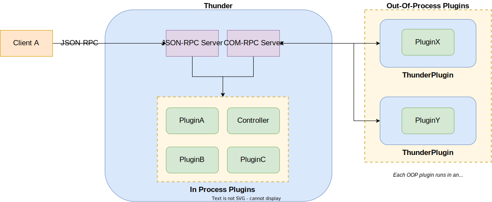

A Thunder plugin can be configured to run in multiple different "execution modes". Each mode defines how the plugin code is executed, however it does not affect how a client will interact with the plugin. Clients will not know (and shouldn't care!) which mode a plugin is running in, and will continue to connect/communicate through the main Thunder process.

Providing a plugin correctly implements a COM-RPC interface, there should be no additional development work in the plugin to support running in different execution modes, so the decision on which mode each plugin runs in can be an architecture decision based on platform, performance and security requirements.



## Setting the execution mode

The execution mode of a plugin is set in its configuration file. If an execution mode is not specified a plugin will defaut to running in-process. 

To change the mode, set the `mode` value in the `configuration.root` object to:

* Off (aka in-process)
* Local (aka out-of-process)
* Container
* Distributed

As with other config options, this can be changed via the Controller plugin at runtime. The below example config sets the plugin mode to `Local` in order to run the plugin out-of-process

```json
{
   "locator":"libThunderSamplePlugin.so",
   "classname":"SamplePlugin",
   "startmode":"Activated",
   "configuration":{
      "root":{
         "mode":"Local"
      }
   }
}
```