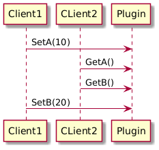
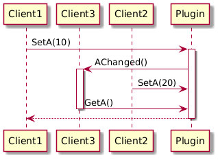
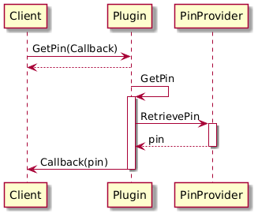

Interface Definition
====================

Table of Contents
=================

1. [Introduction](#Introduction)
2. [Rule, Guideline or Recommendation](#RuleRecommendationGuideline)
3. [Rules](#Rules)
    1. [Interfaces should not leak implementation details](#InterfacesShouldNotLeakImplementationDetails)
    2. [Comply to the Single Responsibility Principle (SPR)](#ComplyToSingleResponsibilityPrinciple)
    3. [Interfaces published cannot change, only extend](#InterfacesPublishedCannotChangeOnlyExtend)
4. [Guidelines](#Guidlines)
    1. [Interface methods that are implementation invariant should be marked const](#InterfaceMethodsThatAreImplementationInvariantShouldBeMarkedConst)
    2. [Use nested INotification name for one-to-many dependency](#UseNestedInotificationNameForOnetomanyDependency)
    3. [Use nested ICallback name for one-to-one dependency](#UseNestedIcallbackNameForOnetooneDependency)
5. [Recommendations](#Recommendations)
    1. [State complete interfaces](#StateCompleteInterfaces)
    2. [Return "core::hresult” on methods](#ReturnCorehresultOnMethods)
    3. [Specifically define the length of the enum to be used](#SpecificallyDefineTheLengthOfTheEnumToBeUsed)
    4. [Be verbose even if there is functionally no need](#BeVerboseEvenIfThereIsFunctionallyNoNeed)
6. [Mandatory keywords in an interface definition](#MandatoryKeywordsInAnInterfaceDefinition)
7. [Tags/annotations available for optimizing the generated code](#TagsAnnotationsAvailableForOptimizingTheGeneratedCode)
8. [Practical Considerations](#PracticalConsiderations)
    1. [Less is more](#LessIsMore)
    2. [Static and Dynamic behaviour](#StaticAndDynamic)
    3. [Frequency versus Quantity](#FrequencyVersusQuantity)
    4. [Prefer multiple smaller interfaces over one big one](#PreferMultipleInterfaces)
    5. [Asynchronous interfaces](#AsynchronousInterfaces)

Introduction {#Introduction}
============

Interface-based development offers several advantages:

1. **Modularity**: By defining interfaces, different modules of a system can interact with each other without necessarily knowing about the implementation details. This promotes a modular design which makes the system easier to understand, maintain, and extend.
2. **Flexibility**: Interfaces allow for the decoupling of components within a system. This means that components can be swapped out or updated without affecting other parts of the system, as long as they adhere to the defined interface contract.
3. **Multiple Inheritance**: In languages that support multiple inheritance through interfaces, a class can implement more than one interface, allowing it to inherit behavior from multiple sources. This provides flexibility in defining the functionality of a class.
4. **Abstraction**: Interfaces allow developers to focus on what needs to be done rather than how it is done. By defining a clear contract in the form of an interface, developers can work independently on different parts of a system without worrying about the internal complexities of other components.
5. **Interoperability**: Interfaces facilitate interoperability between different components or even different systems. By adhering to a common interface, different parts of a system or different systems altogether can communicate effectively.
6. **Testing**: Interfaces help in unit testing by allowing developers to create mock objects that implement interfaces. This enables easier testing of individual components in isolation, leading to more robust and reliable code.

Overall, interface-based development promotes a modular, flexible, and maintainable codebase that is easier to work with and extend over time.

To exploit these advantages to the fullest, Thunder uses Interfaces definitions between plugins and internally. The interface definitions created for Thunder should adhere to certain rules/recommendations and guidelines. This document describes these Rules/Recommendations and guidelines for designing a good interface and the syntax to be used to describe the interface. 
With the Thunder interface definitions it is also possible by using the @json tag to (partially) expose the Thunder inter-plugin/internal interface as a JSON-RPC interface. The below Rules, Guidelines and Recommendations apply also to JSON-RPC interfaces. Please see [here](https://rdkcentral.github.io/Thunder/pr-preview/pr-1721/plugin/interfaces/interfaces/) for a more detailed description on how the JSON-RPC interface can be fully generated and documented from the Thunder interface specification without writing a single line of code. Of course deciding if and what part of your interface should be exposed as JSON-RPC interface should also be careful considered. 


Rule, Guideline or Recommendation {#RuleRecommendationGuideline}
=================================

Here are the distinctions between a rule, a recommendation, and a guideline:

1. **Rule**:
    * A rule is a prescribed directive or principle that must be followed strictly. It is typically mandatory and non-negotiable.
    * Rules often have legal or formal implications and violations may lead to consequences or penalties.
    * Rules are usually clear, specific, and binding, leaving little room for interpretation or deviation.
2. **Guideline**:
    * A guideline is a set of general principles that provide guidance or direction on how to achieve a particular objective.
    * Guidelines are more flexible than rules, as they offer suggestions on the most effective way to accomplish a task or goal.
    * They serve as a framework for good practice and can be adapted or customized based on specific circumstances or requirements.
3. **Recommendation**:
    * A recommendation is a suggestion or advice on the best course of action, but it is not mandatory, they offer more freedom than guidelines .
    * Recommendations are based on best practices, standards, or guidelines, but individuals or organizations have the freedom to choose whether or not to follow them.
    * While recommendations are meant to guide decision-making, they allow for flexibility and individual judgment in applying them.

In summary, rules are strict, mandatory, and non-negotiable directives, recommendations are suggestions or advice that are not obligatory, and guidelines offer flexible principles for achieving a specific objective.

Rules {#Rules}
=====

Interfaces should not leak implementation details {#InterfacesShouldNotLeakImplementationDetails}
-------------------------------------------------

Interfaces should be designed to provide a clear and concise abstraction of functionality without exposing the underlying implementation details. Here are some reasons why interfaces should not leak implementation details:

* **Encapsulation**: By hiding implementation details, interfaces ensure that the internal workings of a system or component are not exposed to the outside world. This promotes encapsulation, which is a core principle of object-oriented design.
* **Flexibility and Maintainability**: When interfaces do not expose implementation details, the underlying code can be changed, optimized, or refactored without affecting the code that depends on the interface. This makes the system more adaptable and easier to maintain.
* **Abstraction**: Interfaces should provide a high-level abstraction that defines what operations can be performed without detailing how they are performed. This allows users of the interface to focus on the "what" rather than the "how," making the system easier to understand and use.
* **Reduced Coupling**: If implementation details are hidden, components that depend on the interface are less tightly coupled to specific implementations. This helps in reducing dependencies and makes it easier to swap out one implementation for another.
* **Security**: Hiding implementation details can also enhance security by preventing unauthorized access to sensitive information or potential manipulation of internal processes.
* **Interchangeability**: When interfaces do not leak implementation details, it becomes easier to interchange different implementations of the same interface. This is particularly useful in scenarios where multiple implementations might be needed, such as testing with mock objects or switching between different service providers.
* **Simpler API**: A clean interface that hides complexity makes the API simpler and more intuitive to use. Users of the interface do not need to understand the complexities behind the scenes, leading to a better experience for the user of the interface.

To achieve these benefits, interfaces should be carefully designed to define clear and minimal contracts for interaction, focusing on what needs to be done rather than how it is done.

Comply to the Single Responsibility Principle (SPR) {#ComplyToSingleResponsibilityPrinciple}
---------------------------------------------------

The single-responsibility principle (SRP) is a computer programming principle that states that "A module should be responsible to one, and only one, actor." The term actor refers to a group (consisting of one or more stakeholders or users) that might require a change to the module. In other words a module,class,interface should have only one reason to change, gather together the things that change for the same reasons. Separate those things that change for different reasons. 

SRP is a fundamental principle in software development and also (or perhaps even more strongly) applies to interfaces as well, which should also adhere to the idea of having a single, well-defined responsibility. Here are some reasons why interfaces should comply with the Single Responsibility Principle:

* **Clear and focused functionality**: Interfaces that adhere to the SRP are easier to understand and work with because they have a clear and focused purpose. Developers can quickly grasp what the interface is meant to do and how it should be implemented.
* **Encourages better design**: By adhering to the SRP, interfaces are more likely to be well-designed and follow best practices in software development. Separating different responsibilities into distinct interfaces helps to create a more modular and maintainable codebase.
* **Easier to maintain and extend**: When an interface has a single responsibility, changes to that responsibility are less likely to impact other parts of the codebase compared to when the interface would have multiple responsibilities, then it would be more likely to touch different parts of the codebase when changed. This makes it easier to maintain and extend the code without causing unintended consequences or introducing bugs.
* **Promotes code reusability**: Interfaces that adhere to the SRP are more likely to be reusable in different contexts. Since each interface represents a single responsibility, it can be easily reused in various parts of the codebase without introducing unnecessary complexity.
* **Improved testability**: Interfaces with a single responsibility are often easier to test because their behavior is well-defined and focused. This makes it simpler to write unit tests for classes that implement the interface and ensures that each component of the software can be tested effectively in isolation.
* **Enhanced flexibility**: Interfaces that follow the SRP are more flexible and adaptable to changes in requirements. If a new responsibility needs to be added (so with SRP less likely to influence an existing interface) or an existing one modified, it can be done more easily without affecting other parts of the codebase.

In conclusion, interfaces that comply with the Single Responsibility Principle are easier to understand, maintain, and extend. By keeping interfaces focused on a single responsibility, developers can create more modular, reusable, and robust software systems.

Interfaces published cannot change, only extend {#InterfacesPublishedCannotChangeOnlyExtend}
-----------------------------------------------

When it comes to interfaces, it's important to extend them rather than change them directly to maintain compatibility with existing code. By extending an interface, you can add new functionality without breaking the code that already uses the interface. This allows for a more flexible and scalable design, as different classes can implement the new interface without affecting the existing codebase. Additionally, extending interfaces promotes the principle of "open-closed" in software design, where classes are open for extension but closed for modification. This helps in creating more maintainable and modular code.
 
Guidelines {#Guidelines}
==========

Interface methods that are implementation invariants should be marked const {#InterfaceMethodsThatAreImplementationInvariantShouldBeMarkedConst} 
---------------------------------------------------------------------------

If a method on an interface is expected to \*not\* functionally change anything in the implementation of the interface, mark the method as const. This allows for passing const interfaces in case the interface needs to be passed to users that should not "control" the implementation.

Use nested INotification name for one-to-many dependency {#UseNestedInotificationNameForOnetomanyDependency}
--------------------------------------------------------

The Observer pattern, is a behavioral design pattern where there is a one-to-many dependency between the parent interface and the INotification (nested child interface) so that when one parent interface implementation changes state, all its dependents INotification child interface implementations are notified and updated automatically.

In software development, this pattern is commonly used to establish communication between different parts of a system without them being directly coupled. The Publisher (or Subject) maintains a list of Subscribers (or Observers) interested in being notified of changes, and when an event occurs or state changes, the Publisher notifies all Subscribers by invoking specific methods on them. This allows for a loosely coupled architecture where changes in one component trigger updates in other components without them having explicit knowledge of each other.

As there is a one-to-many dependency there must be a means to register and unregister the INotification. These must be added to the parent interface and it is a guideline to call these ```core::hresult Register(INotification*)``` and ```core::hresult Unregister(const INotification*);```

``` c++
// @json 1.0.0
struct EXTERNAL IObject : virtual public Core::IUnknown {
    enum { ID = ID_OBJECT };

    // @event
    struct EXTERNAL INotification : virtual public Core::IUnknown {
        enum { ID = ID_OBJECT_NOTIFICATION };
        /* @brief Object visibility changes */
        /* @param hidden: Denotes if application is currently hidden */
        virtual void Changed(const bool hidden) = 0;
        };

    virtual core::hresult Register(INotification* sink) = 0;
    virtual core::hresult Unregister(const INotification* sink) = 0;
};
```

Use nested ICallback name for one-to-one dependency {#UseNestedIcallbackNameForOnetooneDependency}
---------------------------------------------------

The callback pattern in software development is a programming pattern that allows a function to call another function, typically provided as an argument, at a specified point during its execution. It is different from [Use nested INotification name for one-to-many dependency](#UseNestedInotificationNameForOnetomanyDependency) with respect to cardinality. The callback is for a one-to-one dependency.

In this pattern, a callback function is passed as an argument to a higher-order function, which then invokes the callback function at the appropriate time. Callbacks are commonly used in asynchronous programming to handle responses to events that may not occur immediately. They enable non-blocking behavior by allowing a function to continue executing while waiting for a response, and then invoke the callback function with the result when it becomes available.

Callbacks are widely used in event-driven architectures, such as in web development for handling user interactions, network requests, and other asynchronous tasks. They provide a flexible way to customize and extend the behavior of functions and enable efficient handling of asynchronous operations in software systems.

``` c++
// @json 1.0.0
struct EXTERNAL IObject : virtual public Core::IUnknown {
    enum { ID = ID_OBJECT };
    // @event
    struct EXTERNAL ICallback : virtual public Core::IUnknown {
        enum { ID = ID_OBJECT_CALLBACK };
        /* @brief Called if the job has done its work */
        virtual void Completed() = 0;
    };
    Virtual core::hresult Process(ICallback* sink) = 0;
    Virtual core::hresult Abort() = 0;
};
```

Recommendations {#Recommendations} 
===============

State complete interfaces {#StateCompleteInterfaces}
-------------------------
If a method on the interface can change an implementation into a different state, make sure the interface also has methods to revert the entered state. A good example is an interface that can ```core::hresult Start() = 0``` the executions of a job. As the execution of the job has an expected lifespan which is greater that the calls lifespan, make sure there is a method on the interface as well to bring back the interface to the initial, not started state. E.g. an ```core::hresult Abort() = 0``` method. 

Return ```core::hresult``` on methods {#ReturnCorehresultOnMethods}
---------------------------------
As most interfaces are designed to work over process boundaries, it is recommended to cater for issues during the passing of the process boundary, e.g. the other process might have crashed. This means that method calls on interfaces that seem trivial but do change the state of an implementation, like ```SetTime()```, may fail due to cross process communication. If the return value of a method is defined as core::hresult, the Thunder COMRPC framework will signal issues with the communication by returning a negative value. The whole positive range from 0-2147483647 (0-0x7FFFFFFF) is free for the implementer to return values.

Specifically define the length of the enum to be used {#SpecificallyDefineTheLengthOfTheEnumToBeUsed}
-----------------------------------------------------
To allow for the code generator to optimize for the communication frame, it is recommended to always define the length of an enum if it is used as a parameter. If the enum length is not defined, it is assumed to be 32 bits. If an enum only has less than 256 values, it means 3 bytes are wasted on the line.

``` c++
   enum SoundModes : uint8_t {
       UNKNOWN,
       MONO,
       STEREO,
       SURROUND,
       PASSTHRU,
       DOLBYDIGITAL,
       DOLBYDIGITALPLUS,
       SOUNDMODE_AUTO 
   };
```


Be verbose even if there is functionally no need {#BeVerboseEvenIfThereIsFunctionallyNoNeed}
------------------------------------------------

Describe/define the interface as verbose as possible. This is the contract between two parties, it is better to clearly state what the intention of a parameter is than to leave the intent floating. This means that if a parameter is expected ***not*** to be changed by the implementer define it as const, even if from a C/C++ language point of view it does not add value.

``` c++
core::hresult Logging(const string& cat, bool& enabled /* @out */) const = 0;
core::hresult Logging(const string& cat, const bool enabled) = 0;
```

Although the const bool in the second method has no added value, it is a recommendation to use it, just to indicate clearly that the intent is that the implementation should not and can not change the parameter.

 Mandatory keywords in an interface definition {#MandatoryKeywordsInAnInterfaceDefinition}
==============================================

The following keywords are mandatory in a COMRPC interface definition, which is an interface that can be used over process boundaries. The interface definition complies with the C/C++ standard rules for header file definitions and thus these interfaces can (and will) be used directly in C/C++ code.

``` c++
struct EXTERNAL IObject : public virtual Core::IUnknown {
    enum { ID = ID_OBJECT };
};
```

A ***struct*** in the ***C programming language*** (and many derivatives) is a ***composite data type*** (or ***record***) declaration that defines a physically grouped list of variables under one name in a block of memory, allowing the different variables to be accessed via a single ***pointer*** or by the struct declared name which returns the same address. The struct data type can contain other data types so is used for mixed-data-type records such as a hard-drive directory entry (file length, name, extension, physical address, etc.), or other mixed-type records (name, address, telephone, balance, etc.). In C++ a struct is very similar to a class, only difference is that by default the members have public visibility. 

The ```EXTERNAL``` keyword is used for different platforms to define the link type to be used when trying to access this interface. This typically refers to the default constructor/destructors if generated for a struct.

The ```Core::IUnknown``` must always be the base of the interface to allow for interface navigation (```QueryInterface```) and life-time management of the interface (reference counting). As typical implementations of an interface might implement multiple interface by one implementation it is mandatory to all route back to a single lifetime management/Navigational base class (diamond structure) of the core::IUnknown implementation. This is realized by making sure that all interface inherit ```virtual``` from the ```Core::IUnknown```. 

As small-as-it-gets is what Thunder stands for, so identifying an interface by a name (or using a GUID, as Microsoft did) is a bit of overkill. Thunder uses an ID which should be unique. The ID to be assigned to the interface is mandatory and it is defines as ```enum { ID = <NUMBER> };``` the number should be unique and thus all ID’s should be registered in ```ids.h``` to guarantee uniqueness.

The ID’s are split up in ranges. 

|begin|end|Owner|ID storage|
|--|-|-|-|
|0x00000000|0x00000080|Thunder internal|```Thunder/Source/plugin/ids.h```|
|0x00000080|0x80000000|Public Plugin interfaces|```ThunderInterfaces/interfaces/ids.h```|
|0x80000000|0xA0000000|Custom Plugin interfaces|```<Custom>```|
|0xA0000000|0xFFFFFFFF|QA Interfaces|```ThunderInterfaces/interfaces/ids.h```|

The Custom range is to accommodate interfaces that are not publicly published and therefore the ID cannot be guaranteed to be unique, by having this range it is at least guaranteed it will not collide with a Thunder or Public interface. The use of non public interfaces is ill advised.

Tags/annotations available for optimizing the generated code {#TagsAnnotationsAvailableForOptimizingTheGeneratedCode}
============================================================
 
Tags/annotations that can be used to optimize the generated code, influence the generated JSON-RPC interface from the interface (if desired at all), or document the interface can be found here:
 
See: [https://rdkcentral.github.io/Thunder/plugin/interfaces/tags](https://rdkcentral.github.io/Thunder/plugin/interfaces/tags/)

Practical Considerations {#PracticalConsiderations}
========================

Less is more {#LessIsMore}
------------

When designing an interface spend some time thinking on how the interface can be as easy to use, understand and can be consistent without the need of adding a lot of documentation and the need of explaining all the cornercases that can happen when using the interface in a certain way.

As an interface is in principle immutable it is better to spend more time on this before releasing the interface than later on trying to improve the interface or writing a lot of documentation explaining on how to use it in certain situations. 

When designing the interface it is good to use the "less it more" principle when adding methods to it to make sure it can do what should be possible with it. 
Less methods will make it easier to understand the interface, less documentation will be needed, it is easier to keep it consistent and there is less need to think or document what will happen if you use the methods in an unexpected order. Less methods will also require less testing. 

Let's design an Player Interface as an example. At first one would expect all the following should be possible for a player:

* Start playback
* Stop Playback
* Pause Playback
* Rewind (with a certain speed perhaps)
* Forward (with a certain speed perhaps)

So a naive interface could look like this:

``` c++
struct EXTERNAL IPlayer : public virtual Core::IUnknown {
    enum { ID = ID_PLAYER };

    core::hresult Play() const = 0;
    core::hresult Stop() = 0;
    core::hresult Pause() const = 0;
    core::hresult Rewind(const uint32_t speed) = 0;
    core::hresult Forward(const uint32_t speed) = 0;
};
```
At first this might seem logical but how would you expect the implementation to respond, if you would do Pause(), before Play()? Or Play() after Rewind() without stopping first? You would need to think about all the different options and specify how the interface should respond in that situation. 
But if you think of it, what all the different methods do is specify a certain playback speed. So if you have one method with which you could set the player speed (and allow a negative number) it could do all the above while at the same time be consistent, easy to understand and no need to explain what will happen in certain situation as just the last set speed is the one that is current.
So this is how this was specified in the ISteamer interface [here](https://github.com/rdkcentral/ThunderInterfaces/blob/a229ea291aa52dc99e9c27839938f4f2af4a6190/interfaces/IStream.h#L105C32-L105C53)


Take both Static and Dynamic behaviour into account {#StaticAndDynamic}
------------------------

When designing an interface make sure not only to focus on the static behaviour, meaning what methods and notifications are necessary to make sure the client can use it for its purpose, but also on the dynamic behaviour, meaning how should the interface behave when the methods are called at certain times in a certain order and when certain notifications are sent in between (also see the "Less is more" paragraph above on advise on how to reduce the complexity of the dynamic behaviour). This of course also taking into account that the embedded domain we are operating in with Thunder allows for calls being done from multiple applications and/or threads so any call can happen in parallel with any other or any notification. 

Think about data that needs to be changed and/or read atomically. For example it may look logical in some case to have setters/getters for individual items but if the overall consistency of some items combined needs to be guarded it may make more sense to combine these items in one getter and setter, this prevents one application writing ValueA and then ValueB, while another one reads both A and B in between the two writes and is reading an inconsistent set. 
See for example in the below sequence diagram. If Client1's intention was to set A to 10 and B to 20 and publish that result to the outside world it failed as Client2 will read 10 for A, but for B the value it had before Client1 set it to 20. If the interface only has individual setters and getters the consistency requirement in this case cannot be met, therefore this should be taken into account when designing the interface and make it possible to get and set values that should be treated as consistent set in one method.


Sometimes when this gets very complex one may need to revert to some kind of a transaction support, where one first would start a transaction then does a number of actions and then ends the transaction, only then making the result of all actions in the transaction visible to the outside world in one atomic event. Of course this will make use (and implementation) of the interface much more complex so this would only be advisable when a more simple solution would not suffice. 

Also performance may be an important aspect to take into consideration when thinking about the (dynamic) behaviour of the interface. Suppose an interface is created for storing key value pairs and one expects a client to change and/or read a lot of values after one each other and the writing and reading is expected to be quite resource intensive (for example write take some time) it could be a consideration to make it possible to write/read multiple pairs in one call to prevent the client of creating quite a number of parallel calls that queue up in the framework and or plugin if the client for example would do this from multiple threads or would use CURL or a similar solution to do these calls in parallel. Or depending on the situation and expected usage pattern perhaps make the interface asynchronous so the calls itself will return quickly while the implementation can now handle multiple writes more efficiently by combining them (of course still with some maximum to cap the number of maximum parallel requests to prevent a too high of a peak in resource usage).
In any case make sure to next to the static behaviour of the interface also document the expected dynamic behaviour so that both the implementer of the interface as well as the user know what to expect. 

Also for notifications one should think very carefully how they behave dynamically and what data the notifications do carry. For example a naive idea might be to always sent a notification on a data change event including the new value of the data. Although this may work perfectly if the data does not change much it will have a big influence on the expected behaviour if the data changes often and the consistency of the data read must be guaranteed. 
Suppose one would just sent out the notification for the data changed **without** locking the possibility another user might in parallel change that value, then when the receiver of the notification handles the data, the value could be different then contained in the notification (or worse suppose it reads a second value in the notification handling code via a getter, also that one might have changed and not have the same value when the data in the event was send which might be important). One could choose to lock the complete component for changes of course until all notifications are sent but although now data consistency is guaranteed the component becomes a big bottleneck in the system if changes are frequent and will lead to more resource usage as requests will pile up. 
This can be seen in the sequence diagram below. Client1 changes value A to 10 which leads to the plugin sending a notification to all registered listeners. While Client3 is handling this notification Client2 changes the value for A to 20. In the notification Client3 reads the value for A, should it read 10 or 20? It might be obvious there is no single correct answer to this. This depends on the dynamic behaviour you want the interface to have.


Another example of when thinking about notifications and what data to include in them is very useful is a notification that would include a desired state. Even if the notifications would not happen much having the requested state included might lead to undesired dynamic behaviour. Suppose the notification can request for a transition to state ON and state OFF and the state is in the request. A component could receive a request to change to state ON but in the mean time perhaps a (user) action led to the cancellation of this request before it was handled. If the state was part of the notification the component might start the (expensive) transition to ON because it will only handle the OFF notification after this one, but if the state was not part of the notification but just expressed "StateChange" requested, it would read the requested state via a getter and get the current value which would be OFF in the mean time so it would not unnecessary start the state change to ON. 

So as a summery there is no simple rule for how to correctly design for the dynamic behaviour of the interface, it really depends on the use case. But it should not be done as an afterthought and should also be documented thoroughly where applicable as it can lead to hard to find and fix issues. 

Frequency versus Quantity {#FrequencyVersusQuantity}
------------------------

When designing an interface in an embedded environment where memory, processing power and bandwidth might be limited it is also advisable to think about the frequency and quantity of the data exchange. Even if bandwidth itself is not an issue, sending big chunks of data, or small ones with a high frequency will lead to an increase in resource usage (memory and CPU) for sending and/or handling this. 

So when thinking of the data passed to/from a component via a method on the interface take into consideration if all the data is really needed for handling that call or notification. On the other hand sending very small chunks per call while it is expected up front that multiple calls will be needed to combine enough data to be useful for processing is also not very efficient (certainly for an environment where latency is high). So don't make the amount of data per call an afterthought but pass enough data that can be processed in one call but not more.

As an example when designing an interface to send stored EPG data to a client it probably does not make much sense of sending a month of EPG data for all channels in one call. Probably the client will only display a certain number of channels and a week of data so it would make sense to only send this amount. It also would not make sense to sent it per channel per hour only as that would require multiple calls to combine all information the client is interested in (and might cause additional consistency issues as the data is not retrieved over multiple calls and could change in the mean time).

A technique that can be considered in these kind of situations are iterators that allow retrieval of only part of the data per call, certainly if the whole dataset needs to be kept consistent (but that might come at the cost of keeping a (partial) copy of the data).

Also when sending notifications on certain events keep in mind how often these happen and if the client is always interested in receiving all of these (also see the "Static and Dynamic behaviour" section above). 
If these events happen a lot, the component might become very chatty and it might be a better idea think of solutions on how to reduce the number of events sent (e.g. reduce the number of possible events, make it possible to subscribe to subevents etc.).

Prefer multiple smaller interfaces over one big one {#PreferMultipleInterfaces}
---------------------------------------------------

COM-RPC makes it rather easy to have one component implement multiple interfaces instead of just one and have the user of the interface query if a certain interface is implemented by a component, see the IUnknown QueryInterface method on how to do that.

to briefly reiterate how that works, suppose a component implements multiple interfaces:

``` c++
  class WebKitImplementation :   public Exchange::IBrowser,
                                 public Exchange::IWebBrowser,
                                 public Exchange::IApplication,
                                 public Exchange::IBrowserScripting,
   ...
```

and exposes these interfaces in the interface map:

``` c++
        BEGIN_INTERFACE_MAP(WebKitImplementation)
        INTERFACE_ENTRY(Exchange::IWebBrowser)
        INTERFACE_ENTRY(Exchange::IBrowser)
        INTERFACE_ENTRY (Exchange::IApplication)
        INTERFACE_ENTRY (Exchange::IBrowserScripting)
        ...
        END_INTERFACE_MAP
```

then a client that via any of the available methods got access to an interface of a component (which could also just be the IShell of the plugin of course) can query if an interface is available via the QueryInterface method (that is always available on an interface as it is part of IUnknown):

``` c++
        Exchange::IWebBrowser* webbrowser = service.QueryInterface<Exchange::IWebBrowser>();

        if( webbrowser != nullptr ) {
            ...
            webbrowser->Release();
        } else {
            Exchange::IBrowser* browser = service.QueryInterface<Exchange::IBrowser>();

            if( browser != nullptr ) {
                ...
                browser->Release();
            }
        ...
```
if the component does not expose the requested interface a nullptr will be returned and logic can be created around the availability of the interface.

This feature of COM-RPC can be used in multiple ways:

* When designing an interface make sure to only give it one distinct responsibility per interface. This makes it easier to understand and maintain the interface but now also gives a component the opportunity to only implement one responsibility and not the other if it does not make sense. The client can, using QueryInterface, check if also the extended functionality is available. For example for a Player interface where you could also change the Volume one would  create a separate IPlayer interface as well as an IVolume, instead of only having an IPlayer interface that would provide both. This will also make reuse of an interface easier as it can be used for any component implementing that responsibility , no reason to say it does not fit the component as only some part of the interface applies to what it is trying to achieve.

* When an interface needs to be extended instead of adding new methods to the existing one, one could add the extended functionality to a new interface. Now the client can also work with components that do not yet implement the new extended functionality (as it can find out with QueryInterface if it is available) while on the other hand you are not forcing an update of all the components that do implement the initial interface, you only update the one(s) for which the extended new functionality makes sense.

Design interfaces to be asynchronous when needed {#AsynchronousInterfaces}
------------------------------------------------

Sometimes when designing an interface it can be expected that the implementation of a certain action can be quite expensive and take some time. 

As a rule anytime the execution of the call will take more than 100 milliseconds or when the duration of an action is non deterministic and worse case would take longer than 100 milliseconds, the interface must be made asynchronous. The interface will then only pass the data needed to start the action to the component and add a callback to the interface to make it possible for the implementation to return the result asynchronously. The component will handle the action in the background (do not use threads for this but use the Thunder workerpool) and call the provided callback when the action is completed to signal this to the initiator of the action. Not only will this prevent the call to fail because of JSON-RPC or COM-RPC timeouts but it will also make sure the framework is not blocked internally and also the client can continue without being blocked waiting for the result (or needed to reserve a thread for this).

For example an interface that will require user interaction for its action (like asking for the pin to be entered) is a perfect example of one that should be made asynchronous as it is of course completely nondeterministic when the call will return as the successful entering of the PIN could take minutes/hours potentially.


Also note, as was pointed out in the "State complete interfaces" paragraph of this page, that there should also be a means to stop the initiated action before it has completed. This is for example needed when the component that started the action needs to shut down and with this it can signal that the action can be stopped as it is no longer needed and the provided callback is no longer valid and should not longer be called.


