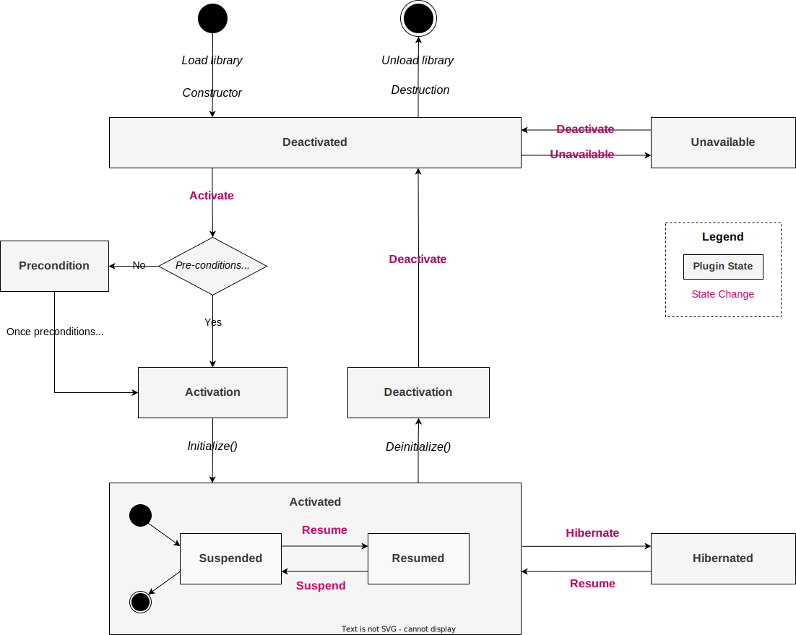

A key responsibility of the Thunder framework is managing the lifecycle of its plugins. All plugins are subject to the same rules regarding lifecycle, which is designed to ensure consistent behaviour. The **Controller** plugin is responsible for managing plugin lifecycle. Some lifecycle features such as suspend/resume require plugins to implement specific interfaces.

## Overview

<figure markdown>
  { width="800" }
  <figcaption>Plugin lifecycle state diagram</figcaption>
</figure>

Each plugin goes through a sequence of states when activated or deactivated. Plugins can be configured to activate automatically when Thunder is started or can be activated manually using the Controller plugin.

Unless otherwise stated in the config, a plugin will default to the Deactivated state when Thunder is started.

Plugins can be in one of the following states at a given time:

| State        | Description                                                  |
| ------------ | ------------------------------------------------------------ |
| Deactivated  | The plugin library has been loaded but the plugin has not been initialised and is not running. In this state, it is not possible to call any methods on the plugin |
| Deactivation | The plugin is currently being deactivated                    |
| Activated    | The plugin library has been loaded and the plugin is initialised. The plugin is running and will respond to function calls. |
| Activation   | The plugin is currently being activated                      |
| Unavailable  | An administrative state used to indicate the plugin is known but not available (e.g. it might be downloaded later) to prevent accidental activation. The plugin must be explicitly moved to Deactivated before it can be activated. |
| Precondition | The plugin is currently waiting on preconditions to be met before it will activate. Once the preconditions are met, it will move to activated |
| Suspended    | *Only available if the plugin implements `IStateControl`*<br /><br />A sub-state of `Activated`. The plugin is activated but has been placed into a suspended state. The exact behaviour of a suspended plugin will depend on the implementation of the `IStateControl` interface. |
| Resumed      | *Only available if the plugin implements `IStateControl`*<br /><br />A sub-state of `Activated`. The plugin is activated and not in a suspended state. The plugin has been initialised, is running and will respond to function calls. |
| Hibernated   | *Only available if Thunder is built with Hibernation support*<br /><br />The plugin has been placed into a hibernated state where the contents of its memory have been flushed to disk. The plugin is not running and will not respond to requests. |

## Activation & Deactivation

Activation and deactivation are the core lifecycle events in Thunder. 

During plugin activation, the library is loaded, constructed and the `Initialize()` method is called. Once the initialise method returns, activation is considered complete and the plugin moves to the Activated state.

When a plugin is deactivated the reverse happens; the `Deinitialize()` method is called, the plugin moves to the Deactivated state and the library is destructed and unloaded. As a result, once a plugin is deactivated it is safe to replace the library file (perhaps to upgrade to a new version) without needing to restart the framework.

!!! note
	All plugin libraries will be quickly loaded & unloaded once during Thunder startup regardless of plugin start mode to retrieve the version information.

Every plugin **must** implement the `Initialize()` and `Deinitialize()` methods from the `IPlugin` interface, which are called during plugin activation and deactivation respectively. After `Initialize()` completes, the plugin must be in a state where it is ready to respond to incoming method calls. 

The `Initialize()` method takes a parameter containing a pointer to the plugin's `IShell` interface. This allows access to information about the plugin instance, such as the loaded configuration. Plugins may want to store a reference to the shell for later access.

If there is a fault during initialisation, `Initialize()` should return a non-empty string that contains the description of the error. The plugin will then move back to a deactivated state. If it returns an empty string, this indicates a successful initialisation and the plugin will move into the Activated state.

!!! danger
	A plugin should do all setup and teardown work in the `Initialize()`/`Deinitialize()` methods, not in the plugin constructor/destructor. Failure to do so may cause stability issues or crashes. The constructor should only be used for simple variable/memory initialization

```cpp
const string TestPlugin::Initialize(PluginHost::IShell* service)
{
    ASSERT(_service == nullptr);

    TRACE(Trace::Initialisation, (_T("Initializing TestPlugin")));

    _service = service;
    _service->AddRef();

    // Success, return an empty string
    return std::string();
}

void TestPlugin::Deinitialize(PluginHost::IShell* service)
{
    ASSERT(_service == service);

    TRACE(Trace::Initialisation, (_T("Deinitializing TestPlugin")));

    _service->Release();
    _service = nullptr;
}
```

### Preconditions

Plugins can define pre-conditions either in their config file or in their metadata, which are Thunder subsystems that must be active for the plugin to move to an activated state.

If an attempt is made to activate the plugin whilst the preconditions are not met, then the plugin will be placed in a Preconditions state and wait. As soon as the preconditions are met, then the plugin will automatically move to the activated state.

### Reasons

When a plugin is activated or deactivated, a reason must be provided to explain why the state change occurred. 

```cpp
virtual Core::hresult Activate(const reason) = 0;
virtual Core::hresult Deactivate(const reason) = 0;
```

The following reasons are available as defined in `IShell`

| Reason                | Description                                                  |
| --------------------- | ------------------------------------------------------------ |
| Requested             | The state change was intentionally requested - either by Thunder itself or by a client application. This is the default reason |
| Automatic             | The state change occurred automatically (e.g. the Monitor plugin might restart a plugin that crashed and would specify the Automatic reason to indicate this was not a manual decision) |
| Failure               | A generic error occurred and the plugin changed state to reflect this. An example scenario that would trigger this reason would be the out-of-process component of a plugin unexpectedly crashing |
| Memory Exceeded       | The plugin exceeded a given memory limit. Used by the Monitor plugin |
| Startup               | The state changed due to the plugin being automatically activated when Thunder was started |
| Shutdown              | The state changed due to Thunder shutting down               |
| Conditions            | The state changed due to plugin preconditions no longer being satisfied |
| Watchdog Expired      | The state changed due to a watchdog expiring. For example, used by the WebKitBrowser plugin to provide a hang-detection mechanism that deactivates the plugin if the browser stops responding. |
| Initialization Failed | The Initialize() method of the plugin returned an error and the plugin could not transition to the Activated state |

Certain reasons (as defined in the `exitreasons` value in the main Thunder configuration) may trigger the post-mortem handler for easier debugging.

## Suspend & Resume

Some plugins may wish to implement the ability for clients to suspend or resume their plugin. This can be useful for plugins that may need to free up resources when not in active use, or to pause background jobs without needing to deactivate the entire plugin. 


Since the behaviour of suspend and resume is specific to a particular plugin, Thunder does not enforce suspend/resume support. Instead, if a plugin wishes to allow suspend/resume behaviour, then it must implement the `PluginHost::IStateControl` interface. It is then the plugins responsibility to take suitable actions when moving in or out of a suspended state.

### IStateControl Interface

The `IStateControl` interface (`Source/plugins/IStateControl.h`) requires the plugin to provide implementations for a number of pure virtual methods in order to support suspend/resume.

!!! warning
	The `Configure()` method is deprecated but kept for backwards compatibility. It has been replaced with the `IConfiguration` interface. For new plugins, inherit from `IConfiguration` if a configuration method is required. Otherwise the method should be a stub and just return `Core::ERROR_NONE`. 

```c++
// Deprecated
virtual Core::hresult Configure(PluginHost::IShell* framework) = 0;

// Return the current state of the plugin
virtual state State() const = 0;

// This method is called whenever a state change is requested for the plugin
// The plugin should take whatever action is required to change its state
// Return an error code if the plugin cannot transition state
virtual Core::hresult Request(const command state) = 0;

// Allow clients to register/unregister for state change notifications
virtual void Register(IStateControl::INotification* notification) = 0;
virtual void Unregister(IStateControl::INotification* notification) = 0;
```

The interface also defines a notification the plugin should raise on state change to allow COM-RPC clients to subscribe to state change notifications for the plugin

```cpp
struct INotification : virtual public Core::IUnknown {
    enum {
        ID = RPC::ID_STATECONTROL_NOTIFICATION
    };

    virtual void StateChange(const IStateControl::state state) = 0;
};
```

A plugin should inherit from the interface class, add it to the plugin interface map and add overrides for those methods. It should also maintain a local variable with its current state - which should be initialised to `PluginHost::IStateControl::UNINITIALIZED`.

The important method is `Request(...)` which is called whenever a state change is requested for the plugin. The plugin should compare the requested state to the current state, and if required different take whatever actions are necessary to transition itself to the new state before updating its state internally. If the state changes, it should then raise the `StateChange` notification with the new state.

If the requested state change is invalid (e.g. resuming an already resumed plugin) then return `Core::ERROR_ILLEGAL_STATE`. 

```cpp
Core::hresult TestPlugin::Configure(PluginHost::IShell* service)
{
    // Stub out
    return Core::ERROR_NONE;
}

/**
 * @brief Return the current plugin state
 */
PluginHost::IStateControl::state TestPlugin::State() const
{
    return _currentState;
}

/**
 * @brief Called when a request is made to change the plugin state.
 */
Core::hresult TestPlugin::Request(const PluginHost::IStateControl::command state)
{
    Core::hresult result = Core::ERROR_ILLEGAL_STATE;

    _adminLock.Lock();

    TRACE(Trace::Information, (_T("Received state change request from %s to %s"), 
                               IStateControl::ToString(_currentState), IStateControl::ToString(state)));

    if (_currentState == PluginHost::IStateControl::state::RESUMED &&
        state == PluginHost::IStateControl::command::SUSPEND) {
        // Request to move from resumed -> suspended
        // Do whatever action is necessary to suspend the plugin
        _currentState = PluginHost::IStateControl::state::SUSPENDED;
        result = Core::ERROR_NONE;
    } else if (_currentState == PluginHost::IStateControl::state::SUSPENDED &&
               state == PluginHost::IStateControl::command::RESUME) {
        // Request to move from suspended -> resumed
        // Do whatever action is necessary to resume the plugin
        _currentState = PluginHost::IStateControl::state::RESUMED;
        result = Core::ERROR_NONE;
    } else {
        // Trying to move from/to the same state
        TRACE(Trace::Warning, (_T("Illegal state change")));
    }

    // Fire off a notification to subscribed clients if we changed state successfully
    if (result == Core::ERROR_NONE) {
        for (const auto& client : _stateChangeClients) {
            client->StateChange(_currentState);
        }
    }

    _adminLock.Unlock();
    return result;
}

/**
 * @brief Called by COM-RPC clients to subscribe to state change notifications
 */
void TestPlugin::Register(IStateControl::INotification* notification)
{
    _adminLock.Lock();

    // Make sure a sink is not registered multiple times.
    if (std::find(_stateChangeClients.begin(), _stateChangeClients.end(), notification) == _stateChangeClients.end()) {
        _stateChangeClients.push_back(notification);
        notification->AddRef();
    }

    _adminLock.Unlock();
}

/**
 * @brief Called by COM-RPC clients to unsubscribe from state change notifications
 */
void TestPlugin::Unregister(IStateControl::INotification* notification)
{
    _adminLock.Lock();

    auto index = std::find(_stateChangeClients.begin(), _stateChangeClients.end(), notification);

    if (index != _stateChangeClients.end()) {
        (*index)->Release();
        _stateChangeClients.erase(index);
    }

    _adminLock.Unlock();
}
```

## Hibernate
!!! note
    `Hibernated` state is not available by default. To enable it proper option must be switch on while building Thunder.

Hibernate is a state where plugin is not running and will not respond to requests. Memory of the plugin is flushed to disk and released. When a plugin goes into `Suspended` state it slows down the CPU usage but it still occupies memory. Hibernate allows memory recovery of plugins that are not currently in use. This can come in handy when there is very little available and we need to be careful not to use it all. As the memory must first be written to and then read from disk, this increases the recovery time of the plugin.

 To put plugin in `Hibernated` state three conditions must be met:

* Plugin must be running `Out of process`
* Plugin must be `Activated`
* Plugin must be `Suspended`

Fulfilment of these two conditions allows the **Controller** to save the contents of the plugin memory to disk and release it for further use by the system. To `Hibernate` plugin `Hibernate()` function needs to be called. For every process (parent and children) `HibernateProcess()` is called.
```cpp
uint32_t HibernateProcess(const uint32_t timeout, const pid_t pid, const char data_dir[], const char volatile_dir[], void** storage)
{
    assert(*storage == NULL);
    CheckpointMetaData* metaData = (CheckpointMetaData*) malloc(sizeof(CheckpointMetaData));
    assert(metaData);

    metaData->pid = pid;

    *storage = (void*)(metaData);

    return HIBERNATE_ERROR_NONE;
}
```
Hibernation is made for the main process and all its child processes.
If unsuccessful, the plugin will remain in the `Suspended` state. In case of success, `HIBERNATE_ERROR_NONE` is returned.

### Resuming Plugin
To resume plugin `Wakeup()` needs to be called. It is done automatically when you invoke the `Activate()` method. **Controller** will read the flushed memory from the disk and make the plugin running and responding to requests again. For every process (parent and children) `WakeupProcess()` is called.

```cpp
uint32_t WakeupProcess(const uint32_t timeout, const pid_t pid, const char data_dir[], const char volatile_dir[], void** storage)
{
    assert(*storage != NULL);
    CheckpointMetaData* metaData = (CheckpointMetaData*)(*storage);
    assert(metaData->pid == pid);

    free(metaData);
    *storage = NULL;

    return HIBERNATE_ERROR_NONE;
}
```

In case of success, similar to `HibernateProcess()`, `HIBERNATE_ERROR_NONE` is returned

### Enabling Hibernate
To enable hibernate you need to build Thunder with `cmake` option `HIBERNATE_CHECKPOINTLIB=ON`. You can do this with this command:

```
cmake -DHIBERNATE_CHECKPOINTLIB=ON
```

!!! warning
	To enable `HIBERNATE_CHECKPOINTLIB`, you must have the `Memcr` library available in your project. [Link to Memcr lib](https://github.com/LibertyGlobal/memcr). Make sure the library is correctly installed and that CMake can find it using the find_package command.

## Unavailable Plugins

If required, it is possible to move a plugin to the Unavailable state. This is a purely administrative state that behaves almost identically to the Deactivated state. The only difference is the allowed state transitions in/out of the state - it is not possible to activate an unavailable plugin without first moving it to a deactivated state.

This state was added to make it easier to distinguish between a plugin that is deactivated and a plugin that might not actually be installed on the platform. However, it is not a requirement to use, since plugin libraries are unloaded once the plugin is deactivated.

By default, a plugin will start in the deactivated state. Using the `startmode` option in the plugin config file, it is possible to change this so a plugin starts in the unavailable state.

## Clients: Changing Plugin State

The Controller plugin is responsible for managing plugin lifecycle in Thunder as well as general information and configuration tasks. Controller implements the `IController` interface (`Source/plugins/IController.h`) and exposes both JSON and COM-RPC interfaces.

### JSON-RPC

To change the state of a plugin, call the appropriate method on the Controller plugin. E.G

#### Activate Plugin

:arrow_right: Request

```json
{
	"jsonrpc": "2.0",
	"id": 1,
	"method": "Controller.1.activate",
	"params": {
		"callsign": "TestPlugin"
	}
}
```

:arrow_left: Response

```json
{
	"jsonrpc": "2.0",
	"id": 1,
	"result": null
}
```

If you attempt to transition a plugin to an invalid state (e.g. trying to move from Unavailable directly to Activated), then an ERROR_ILLEGAL_STATE error will be returned

```json
{
	"jsonrpc": "2.0",
	"id": 1,
	"error": {
		"code": 5,
		"message": "The service is in an illegal state!!!."
	}
}
```

#### Check State

The `status` property on Controller will show the current state of the plugin

:arrow_right: Request

```json
{
	"jsonrpc": "2.0",
	"id": 1,
	"method": "Controller.1.status@TestPlugin",
	"params": {}
}
```

:arrow_left: Response

```json
{
	"jsonrpc": "2.0",
	"id": 1,
	"result": [
		{
			// ...
			"state": "resumed",
			// ...
		}
	]
}
```

### COM-RPC

There are multiple options for controlling plugin state over COM-RPC:

* Request the IController interface from Thunder and invoke methods on this to change any plugin state
* Request the IShell interface of a specific plugin and control the state of that particular plugin
  * Note: IShell will allow interface traversal to other plugins using `QueryInterfaceByCallsign(...)`
* If the plugin implements `IStateControl`, then query for that interface then call the `Request()` method on that interface to trigger a state change

#### Controller

```cpp
#include <com/com.h>
#include <core/core.h>
#include <plugins/plugins.h>

using namespace Thunder;

int main(int argc, char const* argv[])
{
    {
        // Controller's ILifeTime interface is responsible for plugin activation/deactivation
        RPC::SmartInterfaceType<Exchange::IController::ILifeTime> controllerLink;
        auto success = controllerLink.Open(RPC::CommunicationTimeOut, controllerLink.Connector(), "Controller");

        if (success == Core::ERROR_NONE && controllerLink.IsOperational()) {
            auto controller = controllerLink.Interface();
            if (controller) {
                // Controller will automatically provide the "Requested" reason
                auto activationSuccess = controller->Activate("TestPlugin");
                
                if (activationSuccess == Core::ERROR_NONE) {
                    printf("Successfully activated TestPlugin\n");
                } else {
                    printf("Failed to activate TestPlugin with error %d (%s)\n", activationSuccess,
                           Core::ErrorToString(activationSuccess));
                }

                controller->Release();
            }
        }
        
        controllerLink.Close(Core::infinite);
    }
    
    Core::Singleton::Dispose();

    return 0;
}
```

#### IShell

```cpp
#include <com/com.h>
#include <core/core.h>
#include <plugins/plugins.h>

using namespace Thunder;

int main(int argc, char const* argv[])
{
    {
        auto engine = Core::ProxyType<RPC::InvokeServerType<4, 0, 1>>::Create();
        auto client = Core::ProxyType<RPC::CommunicatorClient>::Create(Core::NodeId(_T("/tmp/communicator")),
                                                                       Core::ProxyType<Core::IIPCServer>(engine));

        if (client.IsValid()) {
            // Open the TestPlugin IShell
            auto shell = client->Open<PluginHost::IShell>("TestPlugin", ~0, RPC::CommunicationTimeOut);
            if (shell) {
                auto success = shell->Activate(PluginHost::IShell::REQUESTED);
                if (success == Core::ERROR_NONE) {
                    printf("Successfully activated TestPlugin\n");
                } else {
                    printf("Failed to activate TestPlugin with error %d (%s)\n", success,
                           Core::ErrorToString(success));
                }

                shell->Release();
            }

            if (client->IsOpen()) {
                client->Close(RPC::CommunicationTimeOut);
            }
        }

        client.Release();
    }
    
    Core::Singleton::Dispose();

    return 0;
}
```

#### IStateControl

```cpp
#include <com/com.h>
#include <core/core.h>
#include <plugins/plugins.h>

using namespace Thunder;

int main(int argc, char const* argv[])
{
    {
        auto engine = Core::ProxyType<RPC::InvokeServerType<4, 0, 1>>::Create();
        auto client = Core::ProxyType<RPC::CommunicatorClient>::Create(Core::NodeId(_T("/tmp/communicator")),
                                                                       Core::ProxyType<Core::IIPCServer>(engine));

        if (client.IsValid()) {
            // Check if the plugin implements IStateControl
            auto stateControl = client->Open<PluginHost::IStateControl>("TestPlugin", ~0, RPC::CommunicationTimeOut);

            if (!stateControl) {
                printf("Plugin does not support IStateControl so cannot be suspended\n");
            } else {
                // Suspend the plugin
                auto success = stateControl->Request(PluginHost::IStateControl::command::SUSPEND);
                if (success == Core::ERROR_NONE) {
                    printf("Successfully suspended TestPlugin\n");
                } else {
                    printf("Failed to suspend TestPlugin with error %d (%s)\n", success,
                           Core::ErrorToString(success));
                }

                stateControl->Release();
            }

            if (client->IsOpen()) {
                client->Close(RPC::CommunicationTimeOut);
            }
        }

        client.Release();
    }
    
    Core::Singleton::Dispose();

    return 0;
}
```


## State Change Notifications

When a plugin changes state, Thunder will send out a notification to interested subscribers. This allows client applications to take action on plugin state changes.

### JSON-RPC

The Controller plugin will emit state change notifications over JSON-RPC to any websocket client who is subscribed. To receive notifications, subscribe to the `statechanged` event

:arrow_right: Request

```json
{
	"jsonrpc": "2.0",
	"id": 1,
	"method": "Controller.1.register",
	"params": {
		"event": "statechange",
		"id": "sampleClient"
	}
}
```

Then, whenever a state change occurs a message will be sent over the websocket connection containing:

* The callsign of the plugin that changed state
* The new state of the plugin
* The reason the state changed

:arrow_left: Event

```json
{
	"jsonrpc": "2.0",
	"method": "sampleClient.statechange",
	"params": {
		"callsign": "TestPlugin",
		"state": "Deactivated",
		"reason": "Requested"
	}
}
```

### COM-RPC

Controller's `ILifeTime` interface provides a notification that can be subscribed to for state changes.

For the sake of an example, the below code will subscribe to state change notifications then wait for 10 seconds. If a state change occurs, it will print the plugin that changed state, the state it changed to and the reason.

```cpp
#include <com/com.h>
#include <core/core.h>
#include <plugins/plugins.h>

using namespace Thunder;

class StateChangeNotification : public Exchange::IController::ILifeTime::INotification {
public:
    StateChangeNotification() = default;
    ~StateChangeNotification() = default;

    void StateChange(const string& callsign, const PluginHost::IShell::state& state, const PluginHost::IShell::reason& reason) override
    {
		// Use EnumerateType to convert enum to human-readable string
        printf("Plugin %s has changed state to %s due to %s\n", callsign.c_str(),
               Core::EnumerateType<PluginHost::IShell::state>(state).Data(),
               Core::EnumerateType<PluginHost::IShell::reason>(reason).Data());
    }

    BEGIN_INTERFACE_MAP(StateChangeNotification)
    INTERFACE_ENTRY(Exchange::IController::ILifeTime::INotification)
    END_INTERFACE_MAP
};

int main(int argc, char const* argv[])
{
    {
        // Controller's ILifeTime interface is responsible for plugin activation/deactivation
        RPC::SmartInterfaceType<Exchange::IController::ILifeTime> controllerLink;
        auto success = controllerLink.Open(RPC::CommunicationTimeOut, controllerLink.Connector(), "Controller");

        if (success == Core::ERROR_NONE && controllerLink.IsOperational()) {
            auto controller = controllerLink.Interface();
            if (controller) {
                Core::Sink<StateChangeNotification> stateChangeNotification;
                controller->Register(&stateChangeNotification);

                printf("Waiting for state change notifications\n");
                SleepS(10);
                printf("Finished\n");

                controller->Unregister(&stateChangeNotification);
                controller->Release();
            }
        }

        controllerLink.Close(Core::infinite);
    }

    Core::Singleton::Dispose();

    return 0;
}

/* Output
Waiting for state change notifications
Plugin TestPlugin has changed state to Activated due to Requested
Finished
*/
```

